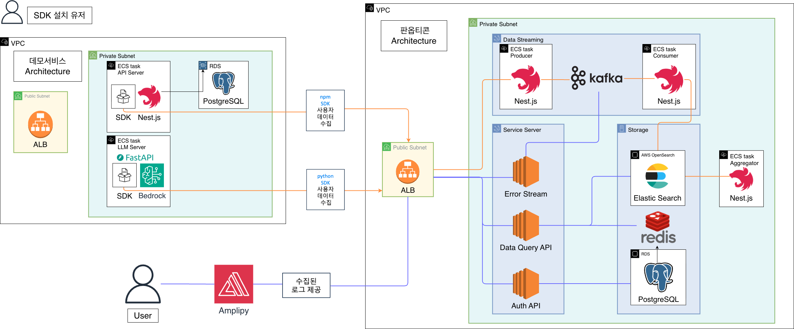
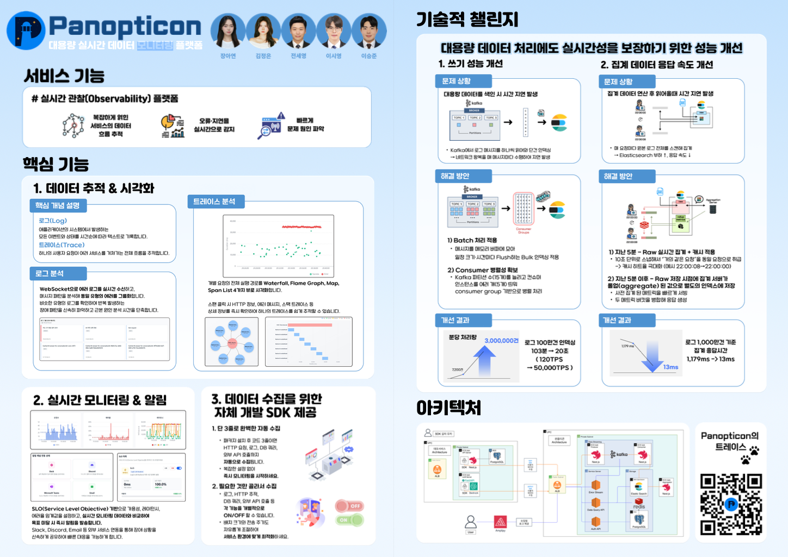

# 👀 Panopticon

<div align="center">

**"모든 서비스의 데이터를 한눈에 관찰하다"**

분산 시스템의 Metrics, Traces, Logs를 통합 모니터링하는 Observability 플랫폼

[최종 발표회 영상 보기](#-데모-영상)

</div>

## 📖 프로젝트 소개

Panopticon은 마이크로서비스 아키텍처 환경에서 발생하는 **장애를 짧은 시간 내에 인지하고 근본 원인까지 파악**할 수 있도록 설계된 통합 관측 플랫폼입니다.

"어디서 문제가 생겼지?"라는 질문에 답하기 위해 흩어진 로그, 트레이스, 메트릭을 하나의 화면에서 연결하여 보여줍니다.

### 📅 프로젝트 기간

프로젝트 전체 기간 **2025.10.27 ~ 2025.11.29** (5주) </br>
프로젝트 기획 기간 **2025.10.27 ~ 2025.11.2** (1주) </br>
프로젝트 개발 기간 **2025.11.3 ~ 2025.11.29** (4주)

### 🎯 핵심 가치

- **빠른 장애 대응**: 실시간 모니터링과 자동 알림으로 장애 발생 즉시 인지
- **통합 분석**: Trace ID 기반으로 로그-트레이스-메트릭을 연결하여 컨텍스트 파악
- **직관적 시각화**: Waterfall, Flame Graph 등 다양한 뷰로 복잡한 데이터를 쉽게 이해
- **SLO 기반 운영**: 사용자가 서비스 품질 목표를 설정하고 실시간으로 준수 여부 모니터링

## ✨ 주요 기능

### 1️⃣ **실시간 서비스 모니터링**

서비스의 요청수, 에러율, 레이턴시(p50/p90/p95)를 3초 간격으로 자동 갱신하여 실시간 모니터링합니다. </br>
시간대별 추이를 한눈에 파악해 트래픽 급증이나 에러 발생 시점을 즉시 식별할 수 있습니다.

### 2️⃣ **엔드포인트별 성능 분석**

상위 엔드포인트를 요청수, 레이턴시, 에러율 기준으로 시각화하여 병목 지점을 빠르게 파악합니다. </br>
각 엔드포인트를 클릭하면 느린 요청(Slow Traces)과 에러 요청(Error Traces)을 즉시 확인할 수 있습니다.

### 3️⃣ **다각도 트레이스 분석**

개별 요청의 전체 실행 경로를 Waterfall, Flame Graph, Map, Span List 4가지 뷰로 시각화합니다.</br>

- **Waterfall View**: 각 스팬의 실행 시간을 타임라인으로 표시합니다. 어느 스팬에 얼마의 시간이 걸렸는지 직관적으로 파악할 수 있습니다.
- **Flame Graph View**: 실행 시간 비중을 시각화하여 시간 소모가 큰 작업을 한눈에 식별할 수 있습니다.
- **Map View**: 서비스 간 호출 관계도를 노드와 엣지로 표현하여 의존성을 쉽게 이해할 수 있습니다.
- **Span List View**: 모든 스팬을 테이블 형태로 나열하여 상세 정보를 비교 분석할 수 있습니다.

각 스팬 클릭 시 HTTP 메서드, URL, Status Code, Duration, Labels, 에러 메시지, 스택 트레이스 등 상세 정보를 즉시 확인할 수 있습니다.

### 4️⃣ **지능형 로그 그룹화**

메시지 패턴을 자동 분석해 동일 유형의 에러를 그룹화합니다. 비슷한 유형의 로그를 확인하여 반복 발생하는 장애 패턴을 신속히 파악하고 근본 원인 분석 시간을 단축합니다. Trace ID를 클릭하면 연결된 트레이스로 바로 이동하여 에러 발생 전후 맥락을 파악할 수 있습니다.

### 5️⃣ **SLO 기반 알림**

SLO(Service Level Objective) 기반으로 가용성, 레이턴시, 에러율 임계값을 설정하고, 실시간 모니터링 데이터와 비교하여 목표 미달 시 즉시 알림을 발송합니다. Slack, Discord, Email 등 외부 서비스 연동을 통해 장애 상황을 팀 전체에 신속하게 공유하여 빠른 대응을 가능하게 합니다.

## 🎨 전체 구조

Panopticon은 **데이터 수집 → 처리 → 저장 → 시각화**의 파이프라인으로 구성되어 있습니다:

1. **데이터 수집 계층**: Monitoring SDK가 애플리케이션에서 Traces, Logs를 수집
2. **수집 및 전처리 계층**: ProducerServer가 데이터를 수신하고 Kafka 토픽에 발행
3. **저장 계층**: OpenSearch에 시계열 데이터를 Data Stream으로 저장 (logs, traces. errors)
4. **집계 계층**: Aggregator가 1분 단위로 메트릭을 사전 집계하여 metrics-apm에 저장하고, Redis로 결과 캐싱
5. **조회 계층**: Query API가 OpenSearch와 Redis를 통해 메트릭, 트레이스, 로그 데이터를 제공
6. **시각화 계층**: Frontend에서 사용자에게 직관적인 대시보드 제공
7. **알림 계층**: SLO 위반 시 Slack/Discord/Email로 알림 발송

## 🛠 기술 스택

## 📂 프로젝트 구조

```
panopticon/
├── panopticon-frontend/           # Panopticon 웹 UI (실시간 모니터링, 트레이스 분석, SLO 알림 등)
├── panopticon-backend/            # Panopticon 백엔드 API 서버 (데이터 수집, 저장, 분석 등)
├── panopticon-demo-service/       # 데이터 발생용 QnA 게시판 서비스 LogQ
├── panopticon-auth-server/        # Panopticon 모니터링 플랫폼의 중앙 인증 서버
└── panopticon-monitoring-sdk/     # 모니터링 SDK 라이브러리 모음
```

## 🛠 시스템 아키텍처

<div align="center">



</div>

## 🎬 프로젝트 시연 영상

<div align="center">

<table>
<tr>
<td width="50%">
<a href="https://youtu.be/l281cGm2agY?si=GzG0Sy5uGpbCk7HT">

</a>
</td>
<td width="50%">

</td>
</tr>
</table>

</div>

## 👥 팀원 소개

<div align="center">

|  |  |  |  |  |
| :----------------------------------------------------------------------------: | :-------------------------------------------------------: | :---------------------------------------------------------------------------: | :----------------------------------------------------------------------------: | :-------------------------------------------------------: |
|                  **[🙋🏻‍♀️ 장아연](https://github.com/ayeon59)**                   |          **[김정은](https://github.com/Jen-kj)**          |                   **[이시영](https://github.com/krsy0411)**                   |                   **[이승준](https://github.com/SJ-Leeee)**                    |        **[전세영](https://github.com/jeonchacha)**        |
|                                    Frontend                                    |                         Frontend                          |                                   Frontend                                    |                                    Backend                                     |                          Backend                          |

</div>

## 📬 문의

- **이메일**: jay3916@naver.com

<div align="center">

**Panopticon으로 분산 시스템을 한눈에 관찰하세요** 👀

Made with 🥕 by Krafton Jungle 10th Team 3

</div>
